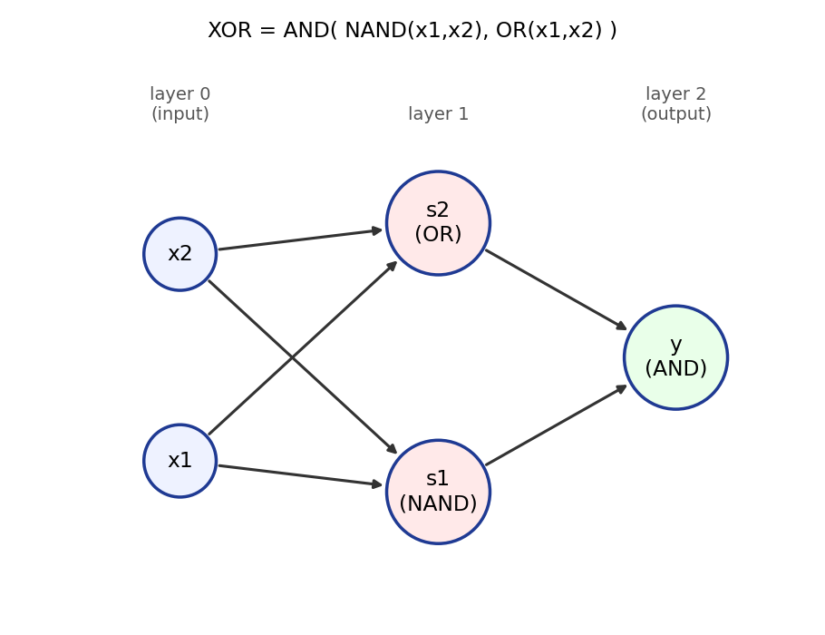
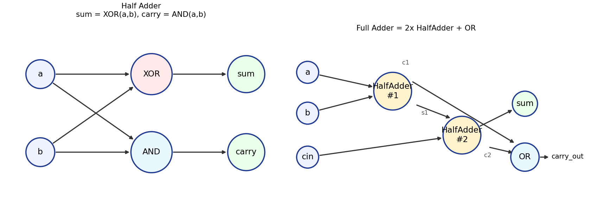

# パーセプトロン 要点まとめ

応用数学研究部 機械学習班 自主ゼミ

---

## 1. パーセプトロンとは？

複数の入力信号を受け取り、それぞれに「重み」をかけて足し合わせ、ある基準を超えたら1、超えなければ0を出力する、最小単位の計算モデル。1957年、Rosenblattが考案した。ニューラルネットワークの起源にあたる。

一般の $n$ 次元で書くと、入力 $x=(x_1,\dots,x_n)\in\mathbb\{R\}^n$、重み $w=(w_1,\dots,w_n)\in\mathbb\{R\}^n$ 、バイアス $b\in\mathbb\{R\}$ に対し

$$ y = 1 \iff w\cdot x + b > 0, \qquad y = 0 \iff w\cdot x + b \le 0. $$

決定境界 $w\cdot x+b=0$ は $\mathbb\{R\}^n$ 内の超平面（ $n=2$ なら直線）。重み $w$ は各入力の重要度、バイアス $b$ は発火しやすさを表す。

---

## 2. 2入力0/1パーセプトロンの定義と論理回路・真偽値表の対応

この章では $n=2$、 $x_1,x_2\in\\{0,1\\}$ に限定する（可視化と論理ゲートが2変数だから、という説明上の都合で、理論上の制約ではない）。

$$ y = \begin\{cases\} 0 & (w_1x_1+w_2x_2+b \le 0) \\ 1 & (w_1x_1+w_2x_2+b > 0) \end\{cases\} $$

$(w_1,w_2,b)$ を変えるだけで、異なる論理ゲートが作れる。

| ゲート | $(w_1,w_2,b)$の例 | $(0,0)$ | $(1,0)$ | $(0,1)$ | $(1,1)$ |
|:---:|:---:|:---:|:---:|:---:|:---:|
| AND | $(0.5,0.5,-0.7)$ | 0 | 0 | 0 | 1 |
| NAND | $(-0.5,-0.5,0.7)$ | 1 | 1 | 1 | 0 |
| OR | $(0.5,0.5,-0.2)$ | 0 | 1 | 1 | 1 |

解は一意ではない（不等式を満たす$(w_1,w_2,b)$の集合は領域になっている）。NANDはANDの符号を全て反転するだけで作れる。

**限界**: XOR（排他的論理和、$(0,0)\to0,(1,0)\to1,(0,1)\to1,(1,1)\to0$）は単層のパーセプトロンでは作れない（線形分離不可能）。1本の直線では、対角どうしが同じ出力になるXORの4点を分けられないため。

---

## 3. 多層パーセプトロンの定義と回路図・合成関数による表現

単層では無理だったXORは、既存のゲートを**重ねる（合成する）**ことで作れる。

$$ s_1 = \mathrm\{NAND\}(x_1,x_2), \qquad s_2 = \mathrm\{OR\}(x_1,x_2), \qquad y = \mathrm\{AND\}(s_1,s_2). $$

入力を第0層、$s_1,s_2$を第1層、$y$を第2層と呼ぶ。重みを持つ層が2つあるので**2層パーセプトロン**（多層パーセプトロン/MLP）。

回路図で見ると、こうなっている:



合成関数としては $\mathrm\{XOR\} = \mathrm\{AND\}\circ(\mathrm\{NAND\},\mathrm\{OR\})$ と書ける。単層では線形領域しか作れないが、層を重ねると非線形領域（XORのような）も表現できる、というのが多層化のご利益。

---

## 4. Pythonによる実装（n階パーセプトロン・2階・合成によるXOR/半加算器/全加算器/nビット拡張）

### n次元パーセプトロン(汎用)

```python
import numpy as np

def perceptron(x, w, b):
    x = np.array(x, dtype=float)
    w = np.array(w, dtype=float)
    return 1 if np.dot(w, x) + b > 0 else 0
```

### 2入力ゲート(1.の特殊ケース)

```python
def AND(x1, x2):
    return perceptron((x1, x2), w=(0.5, 0.5), b=-0.7)

def NAND(x1, x2):
    return perceptron((x1, x2), w=(-0.5, -0.5), b=0.7)

def OR(x1, x2):
    return perceptron((x1, x2), w=(0.5, 0.5), b=-0.2)
```

### XOR(ゲートの合成)

```python
def XOR(x1, x2):
    s1 = NAND(x1, x2)
    s2 = OR(x1, x2)
    return AND(s1, s2)
```

### 半加算器・全加算器

半加算器は sum=XOR、carry=AND。全加算器は半加算器2個＋OR。



```python
def half_adder(a, b):
    """戻り値 (carry, sum)"""
    return AND(a, b), XOR(a, b)

def full_adder(a, b, carry_in):
    """戻り値 (carry_out, sum)"""
    c1, s1 = half_adder(a, b)
    c2, s2 = half_adder(s1, carry_in)
    carry_out = OR(c1, c2)
    return carry_out, s2
```

### nビットへの拡張(リプルキャリー方式)

全加算器を下位ビットから繰り返し適用し、桁上げを次のビットへ伝える。

```python
def n_bit_adder(a, b, n):
    carry = 0
    result_bits = []
    for i in range(n):
        a_bit, b_bit = (a >> i) & 1, (b >> i) & 1
        carry, s = full_adder(a_bit, b_bit, carry)
        result_bits.append(s)
    result_bits.append(carry)
    return sum(bit << i for i, bit in enumerate(result_bits))
```

8ビットまで全組合せ（$65536$通り）で検算済み（`perceptron_implementations.py`）。

> **興味があれば**: NANDゲートだけから出発して、加算器・ALU・メモリ・CPUまで実際に組み立てていくパズルゲーム **「Turing Complete」**(Steam)がある。今日やったAND/OR/XOR/半加算器/全加算器は、このゲームの最初の数レベルそのもの。NANDの組み合わせがどこまで複雑な計算を表現できるか、手を動かして体感できる。

---

## 5. 実装の演習問題

`exercises.py` を開き、`TODO` を埋めて `python exercises.py` を実行し、全ての `assert` が通ることを確認する。

1. **演習1**: `perceptron(x, w, b)` を実装する。
2. **演習2**: `AND`, `NAND`, `OR` を、演習1の `perceptron` を使って実装する。
3. **演習3（メイン）**: `XOR` を `NAND`・`OR`・`AND` の合成として実装する。
4. **演習4**: `half_adder`, `full_adder` を実装する。
5. **演習5（発展）**: `n_bit_adder` を実装し、2ビット・4ビットの全組合せで検算する。

答え合わせは `exercises_solution.py`。

**確認問題**:
- ANDの重みが一意でないのはなぜか。他の $(w_1,w_2,b)$ を1組挙げよ。
- XORが線形分離不可能なことを、自分の言葉で説明せよ。
- 半加算器がなぜ「桁上げ」を別に出力する必要があるのか説明せよ。
